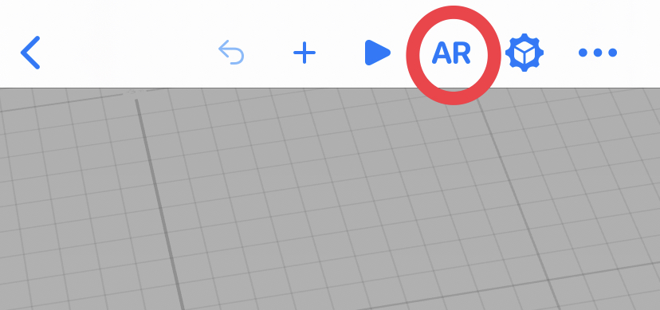

# AR Apple Store by Ethan Saadia
## Visit the Apple Store in an augmented reality experience

## How to use it
1. Clone or download the repo
1. Download [Reality Composer](https://apps.apple.com/us/app/reality-composer/id1462358802) on your Mac, iPhone, or iPad
1. Open the `Apple Store.rcproject` file in Reality Composer
1. Tap the ▶️ button
1. Select the AR button in the toolbar, and enjoy the store!

